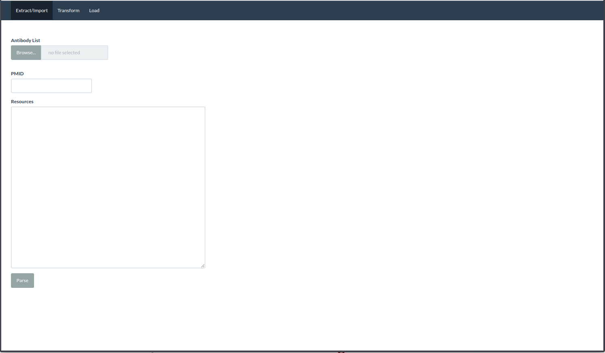
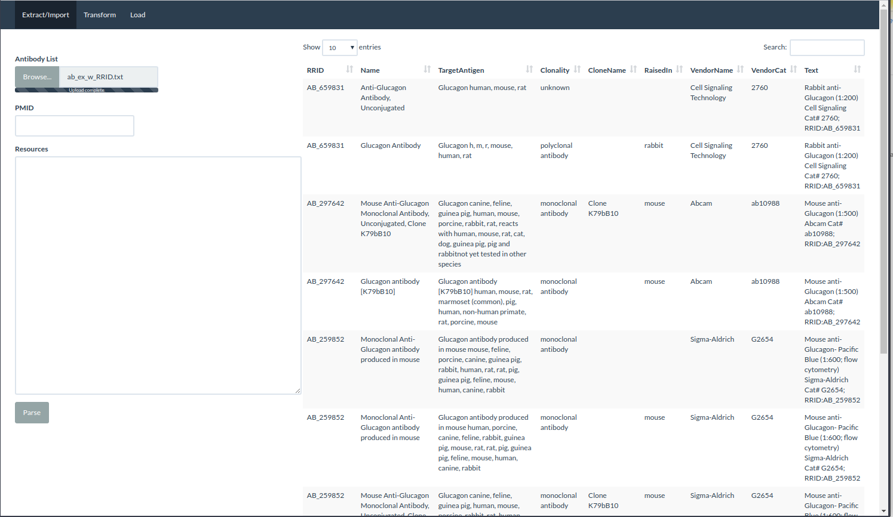
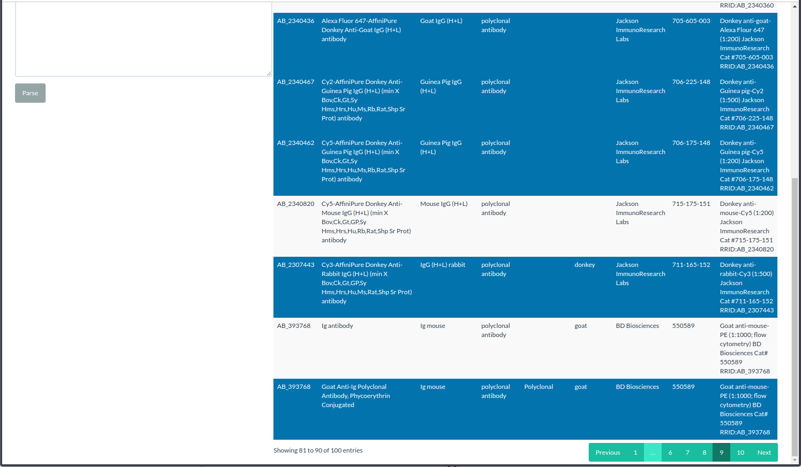
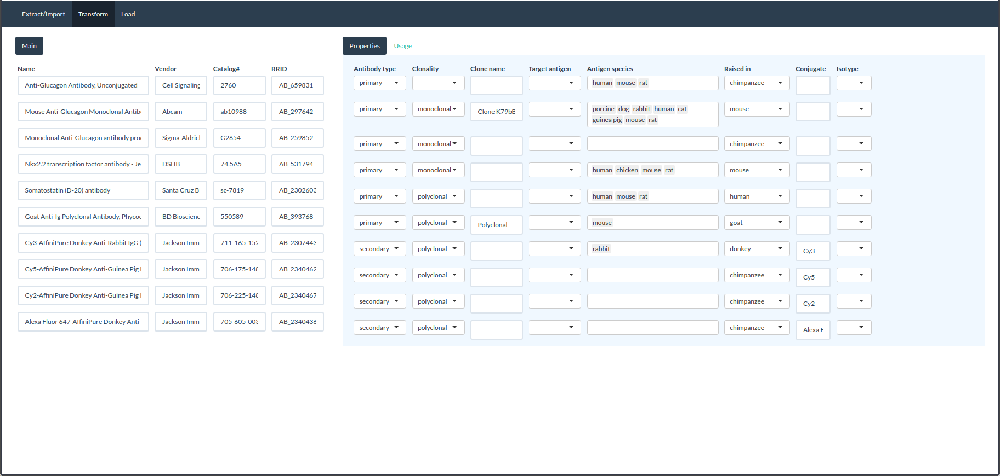
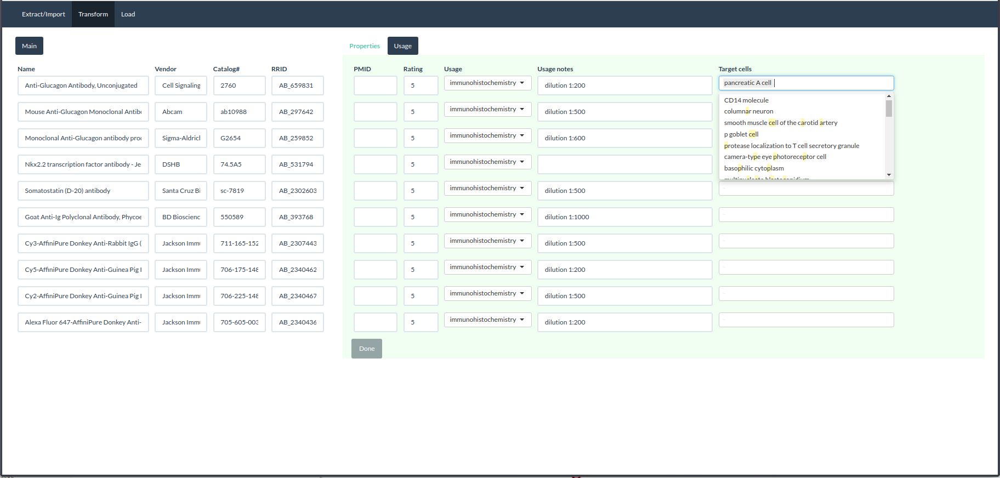

```{r, include = FALSE}
knitr::opts_chunk$set(
  collapse = TRUE,
  comment = "#>"
)
```

```{r setup}

# library(Sourcery)
```

## Introduction

The HIRN Resource Browser has an API for both **retrieving** and **submitting** resources programmatically: https://resourcebrowser.hirnetwork.org/swagger/ui/index. For those who want to use R, this package offers convenience functions, standardizes some steps, and provides examples of using the API for both purposes. Note that to **submit** resources an API key is required.

TO-DO: include steps for getting an API key.


## Submitting resources 

This example is for the working curator or researcher comfortable with R who wants to submit certain types for resources to the Resource Browser with the utilities provided by this package, which basically handle the **extract**, **transform**, **load** process through a helper app powered by API-interfacing functions. The package utilities are most suited for submitting _batch_ data. For submitting only one or two records to the Resource Browser, it is probably still best to use the Resource Browser UI. 

**Examples are provided as the API interface is tested and becomes stable/recommended for general use, so not all resources may be included in this version.** Also, examples vary by type of resource because the inputs and steps required are different; some involve a graphical helper app and others will involve only running a single line of code. The resources that have pretty analogous inputs and steps (such as Dataset and Technology) are grouped together and what is shown will generally apply to the others in the group.

### Antibody resources

**The antibody inputs start with information that a researcher _should_ already have in their notebook at minimum.** If the antibodies don't at least include a reference catalog number, submission usually cannot proceed. A catalog number is required to search/register antibodies with AntibodyRegistry.org (more on this below).
```{r comment=''}
# Content of example file without RRIDs
cat(readLines("ab_ex_no_RRID.txt"), sep = "\n")
```

These RRIDs are the identifiers assigned by AntibodyRegistry.org. Most antibody resources from a commercial vendor already have an RRID, but the curator/researcher must register any novel antibodies encountered. Ideally, we would have an RRID-complete file like this:
```{r comment=''}
# Content of example file with RRIDs
cat(readLines("ab_ex_w_RRID.txt", n = 5), sep = "\n")
```

These inputs are very minimal, and the actual Resource Browser records will include 10+ other pieces of metadata. This is where the Sourcery Extract/Transform process comes in. Aside from the Resource Browser API, Sourcery is powered by the SciCrunch API. We use the SciCrunch API to extract and validate other pieces of resource data. Also, the Sourcery helper app guides through the user through contributing other metadata, such as ratings data. 

First, open up the helper app. 
```{r eval=FALSE}
modAntibodyApp()
```

The browser should launch as the screenshot below shows.


The working curator/researcher would either paste the the content of the input file into the text area or use the upload. Here, we are using the ab_ex_w_RRID.txt file mentioned above. The app will query ScriCrunch and return results with expanded data (not all of which are displayed.)


Go through and select the records that match those from SciCrunch's database. (If you have not registered your novel antibody, it will not be in the results!) After all results have been reviewed, go to the "Transform" tab.


Here we show original input data now transformed/augmented with the "Properties" data from the SciCrunch database. The user is allowed to fill in or correct certain values.


The "Usage" tab is where we gather more unique data for the resource. Certain values like dilution are recognized and filled in automatically if available. The user may specify whether they used this antibody to target a cell type using Cell Ontology classification. Once done, clicking on "Load" will export a file. TO DO: The tab should actually be changed to "Export".



Next comes several lines of code to convert the export to a JSON file and post it as the body to the Resource Browser submission API.

```{r eval=FALSE}
# the complete JSON includes contributor information to the resource
payload <- ab2json("example_export.json")

# apikey is your user apikey
postValidateResource(apikey = apikey, body = payload)
# returns TRUE or FALSE
postLoadResource(apikey = apikey, body = payload)

```

### Dataset and Technology resources

TO-DO: Need to explain input file. Only require 1-2 lines of code as long as input file is correct.

### Protocol resources

TO-DO: Need to explain input file. Only require 1-2 lines of code as long as input file is correct.

### Cell/Tissue resources


## Retrieving resources

Uers might want to get resource data for several different purposes:  

1. For statistical/trend reports -- shown in the examples below.  
2. For practical use of advanced searching/filtering that the Resource Browser UI doesn't allow -- shown in the examples below.  
3. For display or other integration in another application -- not included because you don't need R for this, but developers can refer to the API documentation. 

### Statistical/trend reports 

#### Resource growth over time

Here we will create a stacked bar chart showing different types of datasets added over time (quarterly), showing how the "landscape" of datasets have changed for HIRN. We can also compare the growth of these different types.

```{r dataset}


```


#### Resource impact analysis (coming soon)

Resources have a tentatively-assigned impact quantification. 
```{r impact}


```

### Practical use of advanced searching/filtering 

